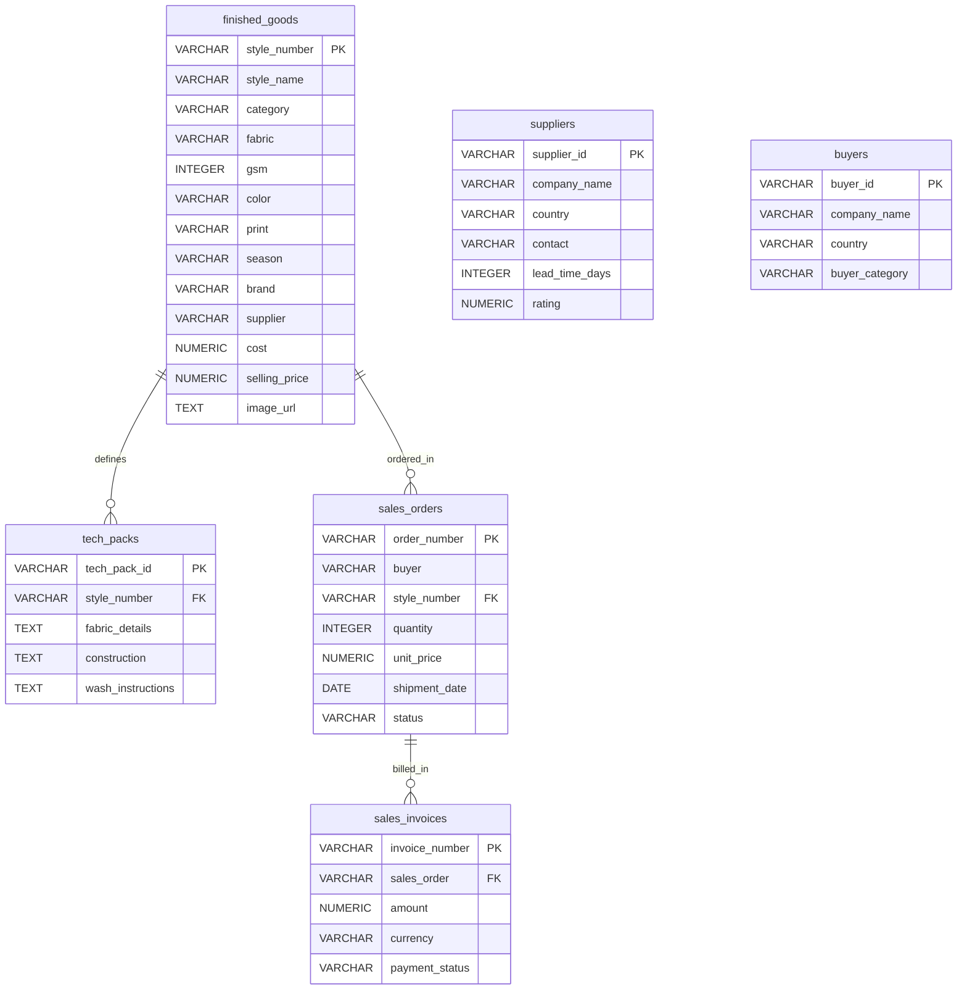

# WFX AI-Powered ERP System (WFX AI Explorer)

An intelligent, AI-powered Enterprise Resource Planning (ERP) platform designed for modern garment manufacturing, supply chain tracking, and sales operations. 

WFX AI Explorer features an advanced **Natural Language to SQL (NL-to-SQL)** query engine powered by Vanna AI and a **Semantic Image Search** backend using OpenAI's CLIP (Contrastive Language-Image Pretraining) model to query and search product catalogs, orders, invoices, tech packs, suppliers, and buyers using plain English text or visual queries.

---

## Features

- **NL-to-SQL Query Execution**: Ask natural language questions (e.g., *"Show me unpaid invoices"* or *"Which suppliers have a rating above 4.0?"*) and get direct table results.
- **Visual & Semantic Search**: Query garments using CLIP embeddings matching natural descriptions (e.g., *"Plum shorts for autumn"*) or similarity scores.
- **Secure Query Sandbox**: Built-in SQL validation checks to allow only safe, read-only SELECT and WITH statements, rejecting dangerous commands like DROP, INSERT, or ALTER.
- **Garment Embedding Cache**: Background processing script to precompute vector embeddings using PyTorch & HuggingFace Transformers.
- **Dockerized Deployments**: Clean container configurations for multi-service environments (FastAPI backend and React+Vite frontend).
- **CI/CD Pipeline**: GitHub Action workflows validating Python syntax, endpoint structure, dependencies, frontend production builds, and container structure on push.

---

## 📂 Project Structure

```text
├── .github/workflows/    # CI/CD pipelines
│   └── ci.yml            # Main test, build, and integration workflow
├── backend/              # FastAPI Application
│   ├── main.py           # Core FastAPI API, Vanna AI configurations, and CLIP search endpoints
│   ├── requirements.txt  # Python requirements (PyTorch, Transformers, Vanna, pg8000, etc.)
│   ├── Dockerfile        # Slim container configuration with model pre-caching
│   ├── .env              # Backend environment configuration
│   ├── precompute_embeddings.py # Generates image/text embeddings cache
│   └── garment_embeddings.json  # Cached style embeddings
├── frontend/             # React + Vite Web Application
│   ├── src/              # App components and layout
│   ├── package.json      # Node scripts and dependencies
│   ├── Dockerfile        # Multi-stage production build using Nginx
│   └── .env              # Frontend API configurations
├── docker-compose.yml    # Combined Docker services orchestrator
└── schema.sql            # SQL Database DDL definitions
```

---

## 🗄️ Database Schema

The platform runs on a PostgreSQL database (Supabase) structured as follows:



### Table Definitions

1. **`suppliers`**: Details of manufacturing vendors.
2. **`buyers`**: Client portfolios.
3. **`finished_goods`**: The product catalogue containing garment specifications, costs, prices, and image asset links.
4. **`tech_packs`**: Technical specifications and manufacturing/wash details linked to style numbers.
5. **`sales_orders`**: Individual client order logs.
6. **`sales_invoices`**: Billing invoices linked to sales orders.

---

## ⚙️ Setup & Configuration

### Environment Variables Checklist

Before starting, create the following configuration files:

#### 1. Backend Config: `backend/.env`
```ini
OPENROUTER_API_KEY=your_openrouter_api_key
SUPABASE_DB_HOST=your_supabase_host
SUPABASE_DB_NAME=postgres
SUPABASE_DB_USER=postgres.username
SUPABASE_DB_PASSWORD=your_db_password
SUPABASE_DB_PORT=6543

# Optional Read-Only Role (Enforces SELECT-only operations for additional safety)
SUPABASE_DB_READONLY_USER=postgres.readonly_user
SUPABASE_DB_READONLY_PASSWORD=readonly_password
```

#### 2. Frontend Config: `frontend/.env`
```ini
VITE_API_URL=http://localhost:8000
```

---

## 🚀 Running the Application

There are two ways to build and run the services:

### Option A: Using Docker Compose (Recommended)

To launch the complete platform (FastAPI backend + React frontend) in production mode:

1. Build and run containers:
   ```bash
   docker compose up --build
   ```
2. Access the portals:
   - **Frontend UI**: [http://localhost:5173](http://localhost:5173)
   - **Backend API Docs**: [http://localhost:8000/docs](http://localhost:8000/docs)

---

### Option B: Local Development Setup

#### 1. Backend Development

Ensure Python 3.12+ is installed:

```bash
# Navigate to backend
cd backend

# Create and activate virtual environment
python -m venv venv
# On Windows
.\venv\Scripts\activate
# On Linux/macOS
source venv/bin/activate

# Install dependencies
pip install -r requirements.txt

# Precompute/refresh embeddings cache (Optional)
python precompute_embeddings.py

# Start developer server
uvicorn main:app --reload --port 8000
```

#### 2. Frontend Development

Ensure Node.js 20+ is installed:

```bash
# Navigate to frontend
cd frontend

# Install Node modules
npm install

# Start Vite live reload server
npm run dev
```

The frontend will run at [http://localhost:5173](http://localhost:5173).

---

## 🧠 Precomputing Embeddings

The search system uses CLIP embeddings stored in `backend/garment_embeddings.json` to prevent fetching and processing image features on the fly. To update this cache when database styles are added or updated:

```bash
cd backend
python precompute_embeddings.py
```
This script downloads garment images from database URLs in parallel and runs the CLIP model (`openai/clip-vit-base-patch32`) to update the features. If an image fails to load, it automatically runs a text-based fallback vector generation.
